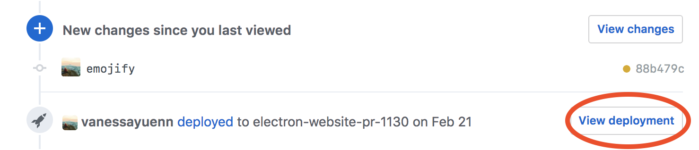
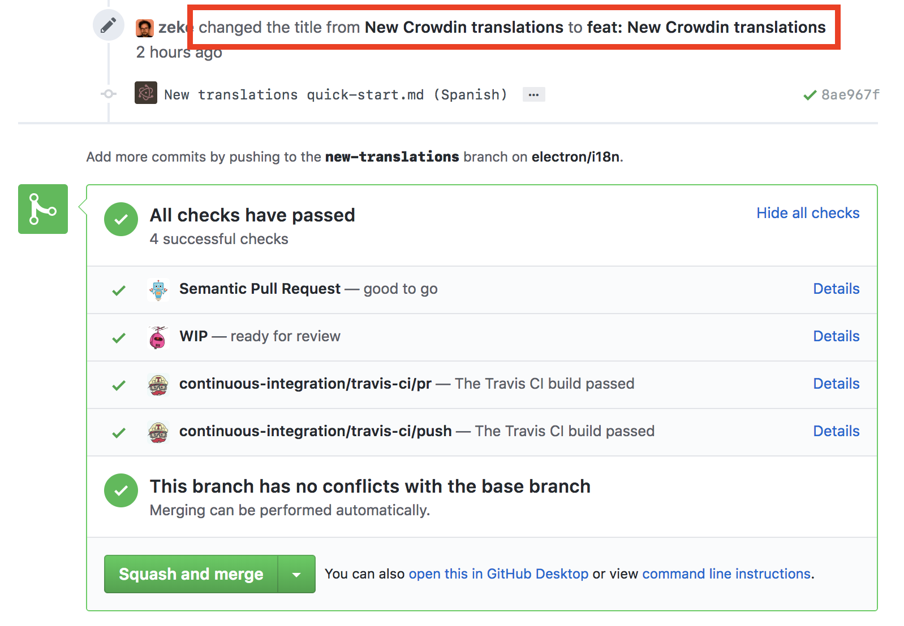
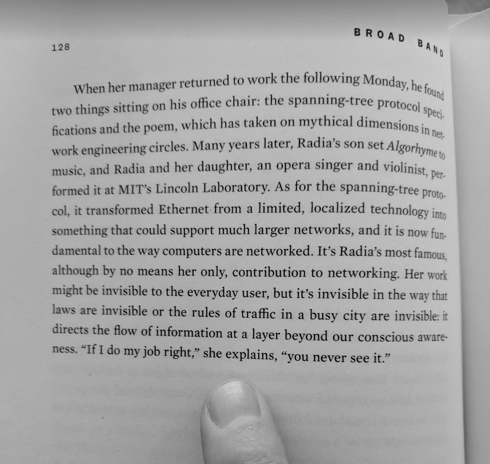

<!-- $theme: default -->

---

# @zeke

---

---

---

---

---

# Workflow

---

# GitHub Community Checklist

---

# Issue Templates

---

# github.com/apps/welcome

---

---

# Generous Permissions

---

---

# Heroku Review Apps

---

# Demonstrable Pull Requests

---

# Continuous Deployment

---

# Semantic Release

write meaningful commit messages and leave versioning up to the machines.

---

# Commit Messages

SemVer's `major.minor.patch` can be thought of as `breaking.feature.fix`:

Commit Message | Semantic Version
------- | -------
`fix: make it work` | Patch
`feat: make it better` | Minor
`BREAKING CHANGE` (in commit body) | Major

---

Semantic Release automates the whole package release workflow, including determining the next version number, generating the release notes, and publishing the package. 

This **removes the connection between human emotions and version numbers**, strictly following the Semantic Versioning specification.

---

--- 

--- 

---

---

---

Bots Bots Bots

---

---

---

---

---

--- 

# github.com/behaviorbot

- welcome
- first-pr-merge
- lock-threads
- new-issue-welcome
- new-pr-welcome
- request-info
- sentiment-bot
- update-docs

---

---

---

